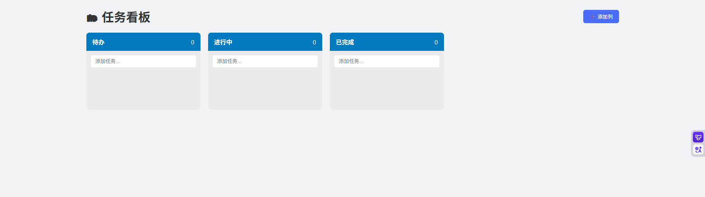

# 🗂 任务看板（Kanban Board）

一个基于原生 JavaScript 实现的可拖拽任务管理看板，支持多列、任务编辑、本地持久化，无需任何框架。

 <!-- 可替换为实际截图 -->

## ✨ 功能亮点

- 🖱 **拖拽移动任务**：使用 HTML5 原生 Drag & Drop API
- ➕ **动态添加列**：自定义工作流阶段（如“测试中”、“审核”）
- ✏️ **双击编辑任务**：快速修改内容
- ❌ **删除任务**：一键清理
- 💾 **自动保存**：数据存入 `localStorage`，刷新不丢失
- 📱 **响应式设计**：支持桌面与平板

## 🛠 技术栈

- HTML5 + CSS3
- 原生 JavaScript（无框架）
- localStorage 数据持久化
- 语义化 DOM 结构

## ▶️ 本地运行

1. 克隆本项目
2. 双击 `index.html` 或使用 Live Server 启动
3. 开始管理你的任务！

## 🔮 进阶扩展建议（可选）

- [ ] 添加任务标签（如 🔴 高优先级）
- [ ] 设置截止日期 + 提醒
- [ ] 导出看板为 JSON / CSV
- [ ] 支持 Markdown 任务描述
- [ ] 多用户协作（需后端，进阶）

> 本项目适合用于个人效率工具，也可作为面试展示项目。