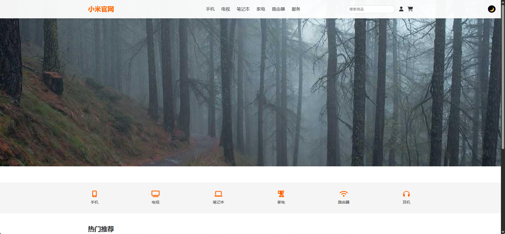
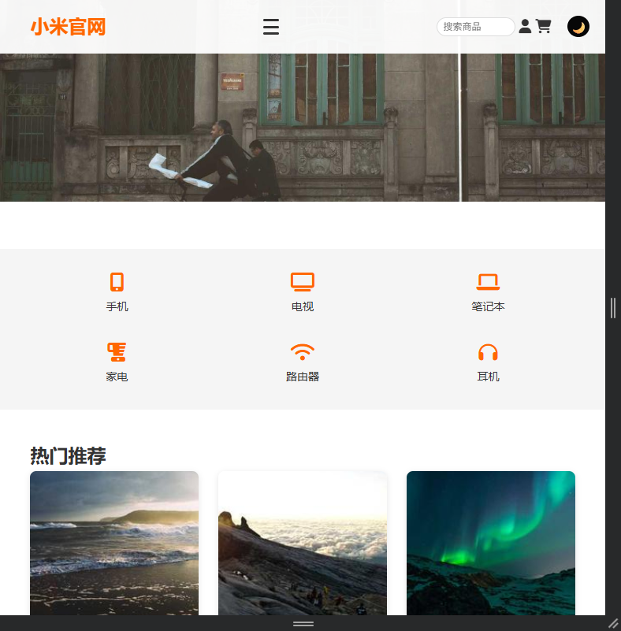

# 🌐 小米商城首页仿写（静态版）

> 一个完全基于 HTML + CSS 的响应式电商首页，仅使用原生技术实现悬停动画与移动端适配。  
> 本项目为前端学习练习，非商业用途。

  


## 📌 项目亮点

- ✅ **真实网站还原**：参考小米官方商城首页结构
- ✅ **响应式设计**：适配桌面、平板、手机
- ✅ **CSS 悬停动画**：商品卡片上浮、图标放大、按钮反馈
- ✅ **语义化 HTML 结构**：清晰易维护
- ✅ **无框架轻量方案**：不依赖 jQuery / React 等库

## 🛠 技术栈

- **HTML5**：语义化标签（`<header>`、`<section>`）
- **CSS3**：Flexbox、Grid、`@keyframes`、伪元素、过渡动画
- **响应式**：媒体查询（Media Queries）
- **静态部署**：GitHub Pages

## 📁 项目结构


## ▶️ 如何运行

1. 克隆或下载项目：
   ```bash
   git clone https://github.com/your-username/mi-homepage.git
   ```
   - 打开 index.html 文件即可在浏览器中查看效果
    - 推荐使用 Chrome 或 Firefox 测试响应式
- 💡 无需服务器，本地运行即可见！
- 在线预览
👉 https://your-username.github.io/mi-homepage

部署步骤（GitHub Pages）
- 将代码推送到 GitHub 仓库
- 进入仓库 → Settings → Pages
- Source 选择 main 分支
- 保存后等待 1 分钟，即可访问
🔍 功能详解
1. 导航栏
- 固定顶部，背景半透明
- 搜索框 + 用户/购物车图标
- 悬停下划线提示
2. 轮播图区域
- 全宽大图展示（使用 Picsum 占位图）
- 可扩展为自动轮播（后续挑战）
3. 商品分类导航
- 图标 + 文字组合
- 悬停时图标放大、文字变色
- 移动端折叠为两行排列
4. 热门推荐区
- 使用 CSS Grid 实现 4 列布局
- 每个商品卡片包含：
- 图片
- 名称
- 价格
“加入购物车”按钮
- 悬停时整体上浮并加深阴影
5. 页脚
- 版权信息
- 学习用途声明

📸 截图示例
| 桌面端 | 移动端 |
|-------|--------|
||