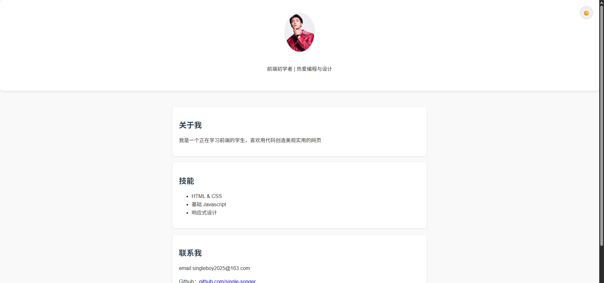
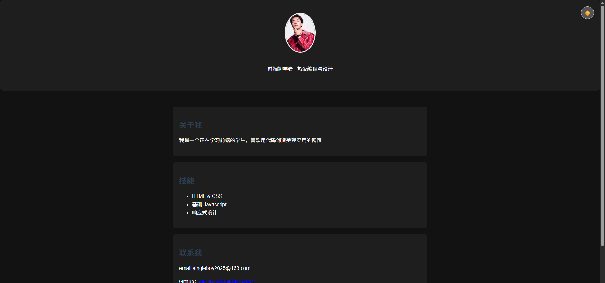

# 🌟 我的个人简介页（增强版）

> 一个响应式、支持暗黑模式、带滚动动画的个人主页 —— 我的第一个前端实战项目！

[](https://your-username.github.io/my-portfolio)
[](https://your-username.github.io/my-portfolio)

## 📌 功能亮点

- ✅ **响应式设计**：适配手机、平板与桌面
- 🌙 **暗黑/亮色主题切换**：点击右上角图标切换，偏好自动保存至 `localStorage`
- 🌀 **滚动淡入动画**：区块进入视口时平滑出现
- 🖼 **自定义 Favicon**：浏览器标签页显示专属小图标
- 🧼 **语义化 HTML + 纯 CSS 布局**：无框架，轻量高效

## 🛠 技术栈

- **HTML5**：语义化结构
- **CSS3**：Flexbox、媒体查询、`@keyframes`、CSS 变量（可扩展）
- **JavaScript（原生）**：主题切换、`IntersectionObserver` 滚动动画、本地存储
- **静态部署**：GitHub Pages

## 📁 项目结构
my-portfolio/

├──assets/

    ├── avatar.png          # 头像

    ├── favicon.png         # 网站图标（32×32 或 64×64）

    ├── screenshot-light.png

    ├── screenshot-dark.png

├── index.html          # 主页面

├── index.css           # 样式文件

├── .js           # 交互逻辑（主题 + 动画）

└── README.md           # 本说明文档

```Text
## ▶️ 本地运行
1. 克隆或下载本项目：
   git clone https://github.com/your-username/my-portfolio.git
```
- 进入目录并打开 index.html：
- 双击文件用浏览器打开，或
- 使用 VS Code 的 Live Server 插件启动本地服务器z
> 💡 无需构建工具，开箱即用！
> 
🌐 在线预览
👉 https://your-username.github.io/my-portfolio

如何部署到 GitHub Pages？
- 将代码推送到 GitHub 仓库
- 进入仓库 → Settings → Pages
- 在 Source 中选择 Deploy from a branch
- Branch 选择 main（或 master），保存
- 等待 1 分钟，即可通过上述链接访问！
- 
📝 自定义指南

修改个人信息：编辑 index.html 中的姓名、简介、联系方式

更换头像：将 .avatar-placeholder 替换为 

调整颜色：在 style.css 中修改亮色/暗色主题的背景与文字色

📸 截图示例
| 亮色模式 | 暗色模式 |
|--------|------------------|
 | 