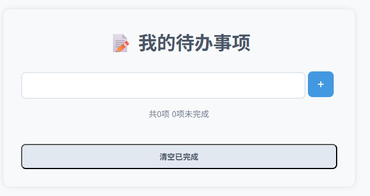

# ✅ 待办事项列表（Todo List）

一个简洁、高效、支持本地持久化的待办事项应用，使用 **原生 HTML + CSS + JavaScript** 构建，无需任何框架。

> 💡 刷新页面后任务不会丢失！所有数据保存在浏览器 `localStorage` 中。

 <!-- 建议替换为实际截图 -->

## 🌟 功能特性

- ✅ 添加新任务（回车快速提交）
- ✅ 标记任务完成（点击复选框）
- ✅ 删除单个任务（点击 ×）
- ✅ 清空所有已完成任务
- 💾 **自动保存**：所有操作实时同步到 `localStorage`
- 📱 **响应式设计**：适配手机、平板、桌面
- 🎨 简洁现代 UI：清晰视觉层次，良好交互反馈

## 🛠 技术栈

- **HTML5**：语义化结构
- **CSS3**：Flexbox 布局、过渡动画、媒体查询
- **JavaScript（ES6+）**：
  - DOM 操作（`querySelector`, `createElement`, 事件委托）
  - 本地存储（`localStorage`）
  - 动态状态管理（完成/未完成）
- **无外部依赖**：纯原生实现，零第三方库

## ▶️ 本地运行

1. 克隆本项目：
   ```bash
   git clone git@github.com:single-songer/collection-of-items.git
   ```
    -进入目录并打开**index.html**
    ```bash
    cd todo-app
    open index.html #mac
    start index.html #window
    ```
   > 或用 VSCode 的live server插件获得最佳体验

📁 项目结构
```Text
todo-list/
├── index.html      # 页面结构
├── style.css       # 样式文件
├── script.js       # 核心逻辑
└── README.md       # 本文件
```
💡 学习价值
- 掌握 前端三件套协同开发 的完整流程
- 理解 用户交互 → DOM 更新 → 数据持久化 的闭环
- 实践 事件委托 优化性能（避免为每个按钮绑定事件）
- 为后续学习 React/Vue 打下坚实基础（状态管理思想雏形）

🔮 进阶扩展建议（可选）
- [ ] 添加任务分类（工作 / 生活）
- [ ] 支持编辑已有任务
- [ ] 设置任务优先级（高/中/低）
- [ ] 增加截止日期与提醒
- [ ] 转换为 PWA（离线可用 + 桌面安装）
 > ✨ 小而美，但五脏俱全 —— 这是你前段之旅的重要里程碑！
 ```Text
 
---

### 📸 如何添加截图？

1. 在浏览器中打开你的待办事项页面
2. 按 `Cmd+Shift+4`（Mac）或 `Win+Shift+S`（Windows）截取应用区域
3. 保存为 `demo.png` 放在项目根目录
4. GitHub 会自动显示图片！

---

### ✅ 下一步建议

将此 `README.md` 放入你的 `project-3-todo-list` 文件夹中，并推送到 GitHub。它将成为你作品集中**最清晰、最专业的项目之一**！
 ```